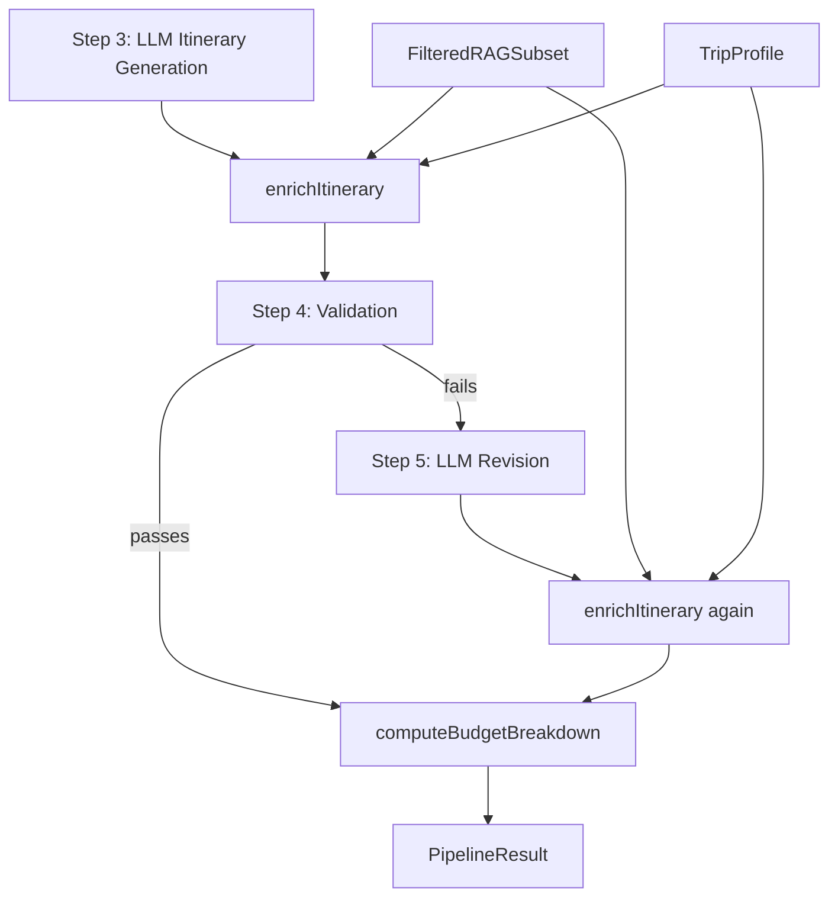

# Design Document: Itinerary Enrichment

## Overview

The itinerary enrichment feature adds a deterministic post-processing step to the Turkey trip planner pipeline. After the LLM generates a raw `Itinerary` (Step 3) and optionally revises it (Step 5), a new pure function — `enrichItinerary` — annotates each `DayEntry` with:

- A **hotel assignment** sourced from `hotels.json` for the day's city
- An **inter-city transport leg** when the next day is in a different city
- **Restaurant suggestions** embedded in meal-segment notes
- **Attraction highlights** embedded in sightseeing-segment notes

All data comes exclusively from the `FilteredRAGSubset` already produced by the RAG retrieval step. No new external calls are made. The budget calculator is updated to read hotel and transport costs directly from the enriched fields rather than inferring them from activity-name keywords.

### Design Goals

1. **Zero LLM calls** — enrichment is pure in-memory computation, completing a 14-day itinerary in under 100 ms.
2. **Fault isolation** — a missing hotel or transport record for one day must not abort enrichment of other days.
3. **Determinism** — same inputs always produce the same enriched output (enables reliable testing and revision re-enrichment).
4. **Minimal surface area** — the enricher is a single exported function; all helpers are module-private.

---

## Architecture



The enricher sits between the LLM steps and the budget calculator. It is called twice when Step 5 runs — once after Step 3 and once after Step 5 — ensuring the budget always reflects the enriched itinerary.

---

## Components and Interfaces

### New Types (`src/types/pipeline.ts`)

```typescript
/** Structured hotel assignment attached to a DayEntry after enrichment. */
export interface HotelAssignment {
  name: string;
  city: string;
  price_per_night: number;
  rating: number;
}

/** Structured transport leg attached to a DayEntry when the next day is in a different city. */
export interface TransportLeg {
  origin_city: string;
  destination_city: string;
  method: string;       // "flight" | "bus" | "train"
  cost_usd: number;
  duration_hours: number;
}
```

### Updated `DayEntry` (`src/types/pipeline.ts`)

```typescript
export interface DayEntry {
  day_number: number;
  city: string;
  morning: DaySegment;
  afternoon: DaySegment;
  evening: DaySegment;
  hotel?: HotelAssignment;                  // added by enrichItinerary
  transport_to_next_city?: TransportLeg;    // added by enrichItinerary
}
```

### New Module: `src/lib/pipeline/step3b-enrichment.ts`

```typescript
/**
 * Enriches a raw LLM-generated Itinerary with hotel assignments,
 * transport legs, restaurant suggestions, and attraction highlights.
 *
 * Pure function: same inputs → same output. No LLM calls, no I/O.
 */
export function enrichItinerary(
  itinerary: Itinerary,
  ragSubset: FilteredRAGSubset,
  profile: TripProfile,
): Itinerary
```

All selection helpers are module-private:

| Helper | Responsibility |
|---|---|
| `selectHotel(city, hotels, travelers)` | Pick best hotel for a city |
| `selectTransportLeg(origin, dest, transport)` | Pick cheapest transport for a city pair |
| `isMealSegment(segment)` | Keyword-detect meal activities |
| `isSightseeingSegment(segment)` | Keyword-detect sightseeing activities |
| `annotateRestaurant(segment, restaurants, usedNames)` | Append restaurant note, rotating through options |
| `annotateAttraction(segment, attractions, interests, usedNames)` | Append attraction note, rotating through options |

### Updated `src/lib/budget.ts`

`computeBudgetBreakdown` gains two new code paths:

1. **Accommodation**: if `day.hotel` is present, use `day.hotel.price_per_night` directly instead of keyword-classifying segments.
2. **Transportation**: if `day.transport_to_next_city` is present, add `transport_to_next_city.cost_usd` to the day's transportation total.

The existing keyword-based segment classification continues to run for food, attractions, and any transportation segments the LLM may have included in activity slots.

### Updated `src/lib/pipeline/index.ts`

```typescript
// After Step 3:
itinerary = enrichItinerary(itinerary, ragSubset, profile);

// After Step 5 (if it ran):
itinerary = enrichItinerary(revisedItinerary, ragSubset, profile);

// Budget always computed on the enriched itinerary:
const budgetBreakdown = computeBudgetBreakdown(itinerary);
```

### Updated `src/components/ItineraryDisplay.tsx`

Two new sub-components:

- **`HotelCard`** — renders inside each day card: hotel name, star rating, price per night. Shows "No hotel data" placeholder when `day.hotel` is undefined.
- **`TransportConnector`** — renders between consecutive day cards when `day.transport_to_next_city` is present: method icon (✈️/🚌/🚆), cost, duration.

The existing `SegmentCard` already renders `segment.notes` as italic text; the 🍽️ and 🏛️ prefixes are embedded in the notes string by the enricher, so no additional rendering logic is needed for those.

---

## Pace-Aware Enrichment

The enricher tailors the depth and volume of enrichment to the traveler's `pace` setting. This ensures the itinerary display feels appropriate — a relaxed traveler sees a clean, simple card; a packed traveler sees a rich, information-dense card.

### Pace Tiers

| Pace | Hotel card | Transport connector | Restaurant annotations | Attraction annotations |
|---|---|---|---|---|
| **relaxed** | Name + price only | Method icon + duration only | 1 annotation max per day (evening meal only) | 0 annotations (no sightseeing clutter) |
| **moderate** | Name + rating + price | Method icon + cost + duration | Up to 2 annotations per day (lunch + dinner) | 1 annotation per day (morning or afternoon) |
| **packed** | Name + rating + price + family-friendly badge | Method icon + cost + duration + all available alternatives listed | Up to 3 annotations per day (breakfast + lunch + dinner) | Up to 2 annotations per day (morning + afternoon) |

### Pace Rules in `enrichItinerary`

```
if pace === 'relaxed':
  maxMealAnnotations = 1          // evening segment only
  maxAttractionAnnotations = 0    // skip attraction notes entirely
  hotelDisplayMode = 'minimal'    // name + price only

if pace === 'moderate':
  maxMealAnnotations = 2          // afternoon + evening segments
  maxAttractionAnnotations = 1    // morning or afternoon segment
  hotelDisplayMode = 'standard'   // name + rating + price

if pace === 'packed':
  maxMealAnnotations = 3          // all three segments if meal-detected
  maxAttractionAnnotations = 2    // morning + afternoon segments
  hotelDisplayMode = 'full'       // name + rating + price + family badge
```

The `maxMealAnnotations` and `maxAttractionAnnotations` counters are tracked **per day** (reset each day). Segment processing order is morning → afternoon → evening; annotations are applied until the per-day cap is reached.

### Pace-Aware `HotelCard` Display Modes

**relaxed** — minimal, uncluttered:
```
🏨 Sirkeci Mansion  ·  $130/night
```

**moderate** — standard with rating:
```
🏨 Sirkeci Mansion  ★ 4.5  ·  $130/night
```

**packed** — full detail with family badge when applicable:
```
🏨 Sirkeci Mansion  ★ 4.5  ·  $130/night  👨‍👩‍👧 Family-friendly
```

### Pace-Aware `TransportConnector` Display Modes

**relaxed** — just the essentials:
```
🚌  9 hrs
```

**moderate** — cost + duration:
```
🚌  $16  ·  9 hrs
```

**packed** — full detail:
```
🚌  Bus  ·  $16  ·  9 hrs
```

### Rationale

- **Relaxed travelers** chose this pace because they want simplicity. Flooding their itinerary with restaurant names and attraction callouts contradicts the "easy days" promise. One dining suggestion per evening is enough.
- **Moderate travelers** get a balanced view — enough detail to plan, not so much that it overwhelms.
- **Packed travelers** explicitly want to see as much as possible. Every meal slot, every sightseeing slot, and full transport detail serves their goal of maximizing information.

---

## Data Models

### Hotel Selection Algorithm

```
selectHotel(city, hotels, travelers):
  candidates = hotels.filter(h => h.city === city)
  if candidates is empty → return undefined

  if travelers > 1:
    familyCandidates = candidates.filter(h => h.family_friendly)
    if familyCandidates is not empty:
      candidates = familyCandidates

  return candidates.sort by rating descending → first element
```

**Rationale**: Family-friendly preference is applied first as a filter, then the highest-rated hotel within the filtered set is chosen. This means a family-friendly hotel with rating 4.0 beats a non-family-friendly hotel with rating 4.9 when `travelers > 1`.

### Transport Leg Selection Algorithm

```
selectTransportLeg(origin, dest, transport):
  candidates = transport.filter(
    t => t.origin_city === origin && t.destination_city === dest
  )
  if candidates is empty → return undefined
  return candidates.sort by cost_usd ascending → first element
```

**Rationale**: The cheapest option is selected regardless of method or duration. This is consistent with the budget-conscious design of the planner.

### Meal Segment Detection

A segment is classified as a meal if its `activity` string (lowercased) contains any of:

```
'breakfast', 'lunch', 'dinner', 'meal', 'eat', 'dining', 'restaurant',
'food', 'cafe', 'café', 'kebab', 'meze', 'baklava', 'tavern', 'bistro',
'cuisine', 'lokanta'
```

### Sightseeing Segment Detection

A segment is classified as sightseeing if its `activity` string (lowercased) contains any of:

```
'visit', 'tour', 'explore', 'museum', 'mosque', 'church', 'palace',
'ruins', 'castle', 'bazaar', 'market', 'temple', 'monument', 'site',
'historic', 'ancient', 'archaeological', 'gallery', 'sightseeing',
'hot air balloon', 'balloon', 'valley', 'canyon', 'cave', 'thermal',
'travertine', 'amphitheatre', 'library', 'agora'
```

### Restaurant Annotation

```
annotateRestaurant(segment, restaurants, usedNames):
  cityRestaurants = restaurants.filter(r => r.city === segment.city)
  if cityRestaurants is empty → return segment unchanged

  // Prefer not-yet-used restaurants; fall back to full list if all used
  available = cityRestaurants.filter(r => !usedNames.has(r.name))
  if available is empty: available = cityRestaurants

  pick = available[0]   // deterministic: first in filtered list
  usedNames.add(pick.name)
  segment.notes = (segment.notes ? segment.notes + ' ' : '') + '🍽️ ' + pick.name
  return segment
```

The `usedNames` set is scoped to the entire itinerary enrichment call, ensuring rotation across days.

### Attraction Annotation

```
annotateAttraction(segment, attractions, interests, usedNames):
  cityAttractions = attractions.filter(a => a.city === segment.city)
  if cityAttractions is empty → return segment unchanged

  // Prefer interest-matching attractions
  interestMatches = cityAttractions.filter(
    a => interests.some(i => i.toLowerCase() === a.category.toLowerCase())
  )
  pool = interestMatches.length > 0 ? interestMatches : cityAttractions

  // Rotate: prefer not-yet-used
  available = pool.filter(a => !usedNames.has(a.name))
  if available is empty: available = pool

  pick = available[0]
  usedNames.add(pick.name)
  segment.notes = (segment.notes ? segment.notes + ' ' : '') + '🏛️ ' + pick.name + ' (' + pick.category + ')'
  return segment
```

---

## Correctness Properties

*A property is a characteristic or behavior that should hold true across all valid executions of a system — essentially, a formal statement about what the system should do. Properties serve as the bridge between human-readable specifications and machine-verifiable correctness guarantees.*

This feature is well-suited for property-based testing: `enrichItinerary` is a pure function over structured data, its input space is large (any combination of cities, hotels, restaurants, attractions, transport records, and traveler profiles), and many of its behaviors are universal invariants rather than specific examples.

The chosen PBT library is **fast-check** (TypeScript-native, widely used in Next.js projects).

---

### Property 1: Hotel city invariant

*For any* itinerary and RAG subset, every day that receives a `HotelAssignment` from `enrichItinerary` must have `hotel.city === day.city`.

**Validates: Requirements 1.2**

---

### Property 2: Highest-rated hotel selection

*For any* city with multiple hotels in the RAG subset and `travelers === 1`, the hotel assigned to a day in that city must have a `rating` greater than or equal to every other hotel for that city in the subset.

**Validates: Requirements 1.3**

---

### Property 3: Family-friendly preference

*For any* city that has at least one `family_friendly: true` hotel in the RAG subset and a `TripProfile` with `travelers > 1`, the assigned hotel must be `family_friendly: true`.

**Validates: Requirements 1.5**

---

### Property 4: Accommodation budget equals sum of hotel prices

*For any* enriched itinerary, `budget.by_category.accommodation` must equal the sum of `day.hotel.price_per_night` for all days that have a `HotelAssignment`.

**Validates: Requirements 1.6, 5.1**

---

### Property 5: Transport leg on city transitions

*For any* itinerary where `days[i].city !== days[i+1].city` and a matching `TransportationRecord` exists in the RAG subset, `days[i].transport_to_next_city` must be defined after enrichment.

**Validates: Requirements 2.2**

---

### Property 6: Lowest-cost transport selection

*For any* origin–destination city pair with multiple `TransportationRecord` entries in the RAG subset, the selected `transport_to_next_city.cost_usd` must be less than or equal to the `cost_usd` of every other record for that pair.

**Validates: Requirements 2.3**

---

### Property 7: Transportation budget includes transport leg costs

*For any* enriched itinerary, `budget.by_category.transportation` must be greater than or equal to the sum of `day.transport_to_next_city.cost_usd` for all days that have a `TransportLeg`.

**Validates: Requirements 2.5, 5.2**

---

### Property 8: Budget grand total equals sum of per-day totals

*For any* enriched itinerary, `budget.grand_total` must equal the sum of `budget.per_day[i].total` across all days.

**Validates: Requirements 5.4**

---

### Property 9: No double-counting in per-day totals

*For any* enriched day that has a `HotelAssignment`, `per_day.accommodation` must equal `hotel.price_per_night` and must not also include any segment cost that was classified as accommodation via keyword matching.

**Validates: Requirements 5.3**

---

### Property 10: Meal segment restaurant annotation

*For any* meal segment in a city that has at least one restaurant in the RAG subset, the enriched segment's `notes` must contain a restaurant name from that city's restaurant list.

**Validates: Requirements 3.1**

---

### Property 11: Halal filter respected

*For any* itinerary enriched with a `TripProfile` that includes `"halal food"` as an interest, every restaurant name appearing in segment notes must correspond to a restaurant where `halal === true` in the RAG subset.

**Validates: Requirements 3.2**

---

### Property 12: Annotation rotation across days

*For any* itinerary with at least two meal segments in the same city and at least two restaurants available for that city, the enriched notes must not reference the same restaurant in every meal segment for that city.

**Validates: Requirements 3.3**

---

### Property 13: Sightseeing segment attraction annotation with interest preference

*For any* sightseeing segment in a city that has at least one attraction in the RAG subset, the enriched segment's `notes` must contain an attraction name from that city. Furthermore, if any attraction in the city matches one of the traveler's interests, the annotation must reference an interest-matching attraction.

**Validates: Requirements 4.1, 4.2**

---

### Property 14: Enricher determinism (purity)

*For any* fixed triple of `(Itinerary, FilteredRAGSubset, TripProfile)`, calling `enrichItinerary` twice must return deeply equal results.

**Validates: Requirements 7.3**

---

### Property 15: Partial failure resilience

*For any* itinerary where some days have no matching hotels, restaurants, or attractions in the RAG subset, the days that do have matching data must still be fully enriched (i.e., the absence of data for one day must not prevent enrichment of other days).

**Validates: Requirements 7.4**

---

### Property 16: Hotel card rendered for any day with hotel

*For any* `DayEntry` with a `HotelAssignment`, the rendered day card HTML must contain the hotel name, a numeric or star rating representation, and the price per night.

**Validates: Requirements 6.1**

---

## Error Handling

| Scenario | Behavior |
|---|---|
| No hotel found for a day's city | `day.hotel` left `undefined`; warning logged to console (no pipeline trace entry — enrichment is not an LLM step) |
| No transport record for a city transition | `day.transport_to_next_city` left `undefined`; warning logged |
| No restaurant for a day's city | Segment `notes` left unchanged |
| No attraction for a day's city | Segment `notes` left unchanged |
| `ragSubset` fields are empty arrays | All enrichments silently skipped; itinerary returned as-is |
| Unexpected exception in per-day processing | Caught at the day level; remaining days continue processing; error logged |

The enricher never throws. All errors are handled locally so the pipeline always receives a (possibly partially enriched) itinerary.

---

## Testing Strategy

### Unit Tests (example-based)

- `selectHotel`: verify city match, highest-rating selection, family-friendly preference, empty-list fallback
- `selectTransportLeg`: verify lowest-cost selection, empty-list fallback
- `isMealSegment` / `isSightseeingSegment`: verify keyword detection with representative activity strings
- `annotateRestaurant`: verify note format, halal filter, rotation across calls
- `annotateAttraction`: verify note format, interest preference, rotation, fallback to any attraction
- `computeBudgetBreakdown` with enriched itinerary: verify accommodation uses `hotel.price_per_night`, transportation includes `transport_to_next_city.cost_usd`
- `ItineraryDisplay` with hotel: verify hotel card renders name, rating, price
- `ItineraryDisplay` without hotel: verify "No hotel data" placeholder
- `ItineraryDisplay` with transport leg: verify method icon, cost, duration appear between day cards
- `ItineraryDisplay` with 🍽️ / 🏛️ notes: verify prefixes render correctly

### Property-Based Tests (fast-check, minimum 100 iterations each)

Each property test is tagged with:
`// Feature: itinerary-enrichment, Property N: <property_text>`

Properties 1–16 above are each implemented as a single property-based test. Generators produce:

- **`arbItinerary`**: arbitrary arrays of `DayEntry` with random cities from `AVAILABLE_CITIES`, random activity strings drawn from meal/sightseeing/other keyword pools
- **`arbRAGSubset`**: arbitrary `FilteredRAGSubset` with random subsets of the real data files (including empty subsets for edge-case coverage)
- **`arbProfile`**: arbitrary `TripProfile` with random `travelers` (1–8), random `interests` subsets, random `pace`

### Integration Tests

- Pipeline orchestrator calls enrichment after Step 3 (mock Step 3 output, verify enriched itinerary reaches Step 4)
- Pipeline orchestrator calls enrichment after Step 5 (mock Step 5 output, verify re-enriched itinerary reaches budget calculator)
- Budget calculator receives enriched itinerary (end-to-end with mocked LLM, verify `budgetBreakdown.by_category.accommodation > 0`)

### Performance Smoke Test

- Generate a 14-day itinerary with all 6 cities and full RAG subset; verify `enrichItinerary` completes in under 100 ms
