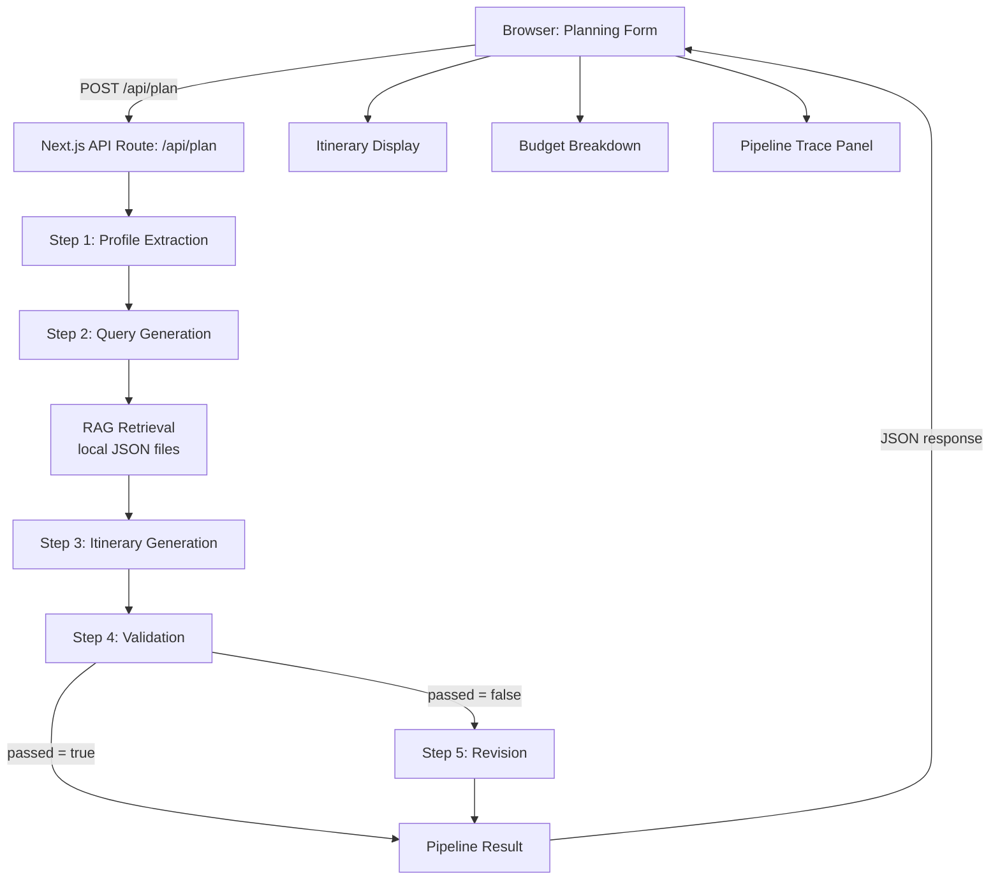
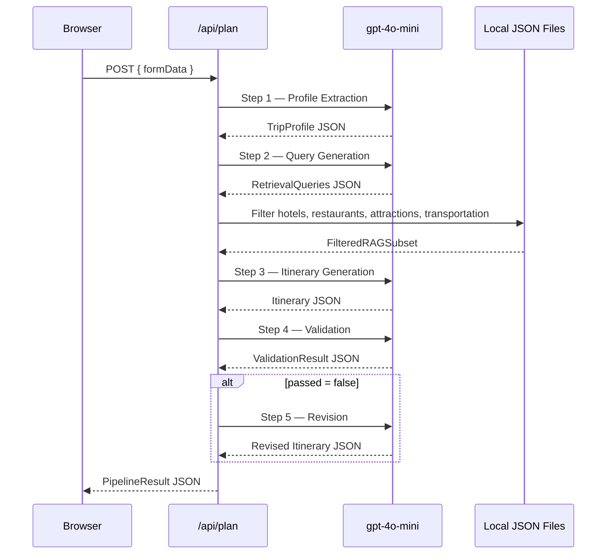

# Design Document: TripMind Turkey

## Overview

TripMind Turkey is a single-page web application that transforms a structured family travel form into a personalized, day-by-day Turkey itinerary. The application runs a deterministic five-step AI pipeline powered by OpenAI `gpt-4o-mini`, using local JSON files as a retrieval-augmented generation (RAG) source to keep responses grounded and costs minimal.

### Goals

- Deliver a complete itinerary with budget breakdown in a single browser session, no authentication required.
- Keep total API cost per generation under $0.05 (target ~$0.006 at current pricing).
- Provide full transparency via a collapsible Pipeline Trace panel.
- Validate and conditionally revise the itinerary before presenting it to the user.

### Non-Goals (MVP)

- No maps, PDF export, or saved/shared trips.
- No user accounts or persistent storage.
- No streaming responses (full JSON responses per step).
- No multi-language support.

### Technology Stack

| Layer | Choice | Rationale |
|---|---|---|
| Framework | Next.js 14 (App Router) | Full-stack React with API routes; SPA-capable; easy Vercel deployment |
| Language | TypeScript | Type safety for pipeline data models and RAG schemas |
| Styling | Tailwind CSS | Rapid, consistent UI without a heavy component library |
| LLM | OpenAI `gpt-4o-mini` | Cheapest capable model; JSON mode supported; $0.15/$0.60 per 1M tokens |
| PBT Library | fast-check | Standard property-based testing for TypeScript; works with Vitest |
| Test Runner | Vitest | Fast, native TypeScript support |

---

## Architecture

The application follows a **client → API route → pipeline** pattern. The browser never calls OpenAI directly; all LLM calls are made server-side through a single Next.js API route, keeping the API key secure.



### Pipeline Execution Model

The pipeline runs sequentially and synchronously within a single API request. Each step receives only the outputs it needs — no step receives the full unfiltered RAG data files. The API route returns a single `PipelineResult` JSON object containing the final itinerary, budget breakdown, and the full trace of all executed steps.



### Token Budget Analysis

With `gpt-4o-mini` at $0.15/1M input and $0.60/1M output tokens, and a maximum of 5 calls at 2,000 input + 1,500 output tokens each:

- Max input tokens: 5 × 2,000 = 10,000 → $0.0015
- Max output tokens: 5 × 1,500 = 7,500 → $0.0045
- **Maximum total cost: ~$0.006 per generation** — well within the $0.05 requirement.

---

## Components and Interfaces

### Frontend Components

```
src/
  app/
    page.tsx                  # Root page — renders PlannerForm or ResultsView
    api/
      plan/
        route.ts              # POST handler — orchestrates the full pipeline
  components/
    PlannerForm.tsx           # Structured trip planning form
    ResultsView.tsx           # Container for itinerary + budget + trace
    ItineraryDisplay.tsx      # Day-by-day itinerary renderer
    BudgetBreakdown.tsx       # Per-day and total cost summary
    PipelineTracePanel.tsx    # Collapsible trace of all pipeline steps
    TraceStep.tsx             # Single collapsible step within the trace panel
    LoadingIndicator.tsx      # Spinner shown during pipeline execution
    ErrorMessage.tsx          # Human-readable error display
  lib/
    pipeline/
      index.ts                # Pipeline orchestrator
      step1-profile.ts        # Profile Extraction step
      step2-queries.ts        # Query Generation step
      step3-itinerary.ts      # Itinerary Generation step
      step4-validation.ts     # Validation step
      step5-revision.ts       # Revision step
    rag/
      retrieval.ts            # RAG filtering logic
      types.ts                # RAG record type definitions
    validation/
      form.ts                 # Client-side form validation
      itinerary.ts            # Budget and structural validation helpers
    openai.ts                 # OpenAI client wrapper (JSON mode calls)
    budget.ts                 # Budget breakdown computation
  data/
    hotels.json
    restaurants.json
    attractions.json
    transportation.json
  types/
    pipeline.ts               # All shared TypeScript types
```

### API Interface

**POST `/api/plan`**

Request body:
```typescript
interface PlanRequest {
  duration: number;          // days, 1–30
  budget_usd: number;        // total budget, > 0
  travelers: number;         // count, >= 1
  cities: string[];          // at least one city
  interests: string[];       // subset of allowed interests
  pace: 'relaxed' | 'moderate' | 'packed';
}
```

Response body (success):
```typescript
interface PlanResponse {
  success: true;
  itinerary: Itinerary;
  budgetBreakdown: BudgetBreakdown;
  trace: PipelineStepTrace[];
}
```

Response body (error):
```typescript
interface PlanErrorResponse {
  success: false;
  error: string;             // human-readable message
  failedStep?: string;       // which pipeline step failed
  trace: PipelineStepTrace[]; // steps completed before failure
}
```

### Pipeline Step Interface

Each pipeline step is a pure async function with a consistent signature:

```typescript
interface PipelineStepResult<T> {
  output: T;
  trace: PipelineStepTrace;
}

interface PipelineStepTrace {
  stepName: string;
  prompt: string;            // full prompt sent to LLM
  rawResponse: string;       // raw JSON string from LLM
  durationMs: number;
}

type PipelineStep<TInput, TOutput> = (
  input: TInput
) => Promise<PipelineStepResult<TOutput>>;
```

### OpenAI Client Wrapper

```typescript
interface LLMCallOptions {
  systemPrompt: string;
  userPrompt: string;
  maxTokens: number;         // capped at 1,500
  schema: Record<string, unknown>; // JSON Schema for structured output
}

async function callLLM(options: LLMCallOptions): Promise<string>
```

The wrapper enforces `response_format: { type: "json_object" }` and `max_tokens: 1500` on every call. It throws a typed `LLMError` on API errors, rate-limit responses, or unparseable JSON.

---

## Data Models

### Form Input

```typescript
interface FormData {
  duration: number;
  budget_usd: number;
  travelers: number;
  cities: string[];
  interests: Interest[];
  pace: TravelPace;
}

type Interest = 'history' | 'halal food' | 'shopping' | 'nature' | 'culture';
type TravelPace = 'relaxed' | 'moderate' | 'packed';

const AVAILABLE_CITIES = [
  'Istanbul', 'Cappadocia', 'Antalya', 'Ephesus',
  'Pamukkale', 'Bodrum'
] as const;
```

### Trip Profile (Step 1 Output)

```typescript
interface TripProfile {
  duration: number;          // integer days
  budget_usd: number;
  travelers: number;         // integer
  cities: string[];
  interests: string[];
  pace: TravelPace;
}
```

### Retrieval Queries (Step 2 Output)

```typescript
interface RetrievalQueries {
  hotel_queries: string[];
  restaurant_queries: string[];
  attraction_queries: string[];
  transportation_queries: string[];
}
```

### RAG Data Records

```typescript
interface HotelRecord {
  name: string;
  city: string;
  price_per_night: number;   // USD
  rating: number;            // 1–5
  family_friendly: boolean;
}

interface RestaurantRecord {
  name: string;
  city: string;
  cuisine: string;
  halal: boolean;
  price_range: number;       // USD per person
}

interface AttractionRecord {
  name: string;
  city: string;
  category: string;
  duration_hours: number;
  cost_usd: number;
}

interface TransportationRecord {
  origin_city: string;
  destination_city: string;
  cost_usd: number;
  duration_hours: number;
  method: string;            // e.g. "flight", "bus", "train"
}

interface FilteredRAGSubset {
  hotels: HotelRecord[];
  restaurants: RestaurantRecord[];
  attractions: AttractionRecord[];
  transportation: TransportationRecord[];
}
```

### Itinerary (Step 3 / Step 5 Output)

```typescript
interface DaySegment {
  activity: string;          // name from RAG data
  cost_usd: number;
  duration_hours: number;
  notes?: string;
}

interface DayEntry {
  day_number: number;
  city: string;
  morning: DaySegment;
  afternoon: DaySegment;
  evening: DaySegment;
}

interface Itinerary {
  days: DayEntry[];
}
```

### Validation Result (Step 4 Output)

```typescript
interface ValidationResult {
  passed: boolean;
  failures: ValidationFailure[];  // empty array when passed = true
}

interface ValidationFailure {
  type: 'budget_exceeded' | 'missing_interest' | 'missing_section';
  description: string;
}
```

### Budget Breakdown

```typescript
interface DayBudget {
  day_number: number;
  accommodation: number;
  food: number;
  attractions: number;
  transportation: number;
  total: number;
}

interface BudgetBreakdown {
  per_day: DayBudget[];
  grand_total: number;
  by_category: {
    accommodation: number;
    food: number;
    attractions: number;
    transportation: number;
  };
}
```

### Pipeline Result

```typescript
interface PipelineResult {
  success: boolean;
  itinerary?: Itinerary;
  budgetBreakdown?: BudgetBreakdown;
  trace: PipelineStepTrace[];
  error?: string;
  failedStep?: string;
}
```

---

## Correctness Properties

*A property is a characteristic or behavior that should hold true across all valid executions of a system — essentially, a formal statement about what the system should do. Properties serve as the bridge between human-readable specifications and machine-verifiable correctness guarantees.*

